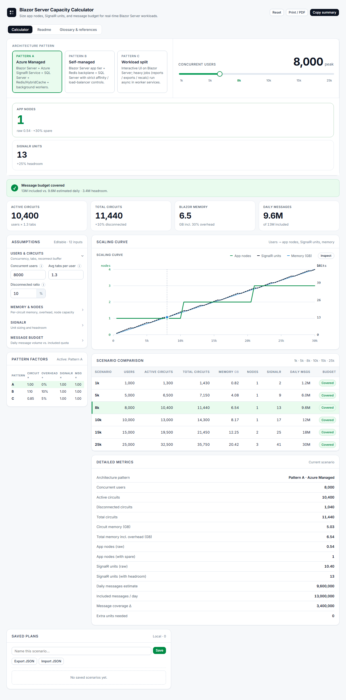

# Blazor Server Capacity Calculator

**Size app nodes, Azure SignalR units, memory, and message budget for real-time Blazor Server workloads — from your measured assumptions, not guesses.**

🔗 **Live tool:** https://blazorperformance.com/tools/capacity-calculator/



Blazor Server capacity planning is genuinely hard: every connected user tab holds a
stateful circuit in server memory, disconnected users linger through a reconnect
window, and Azure SignalR Service is priced in units that cap both concurrent
connections *and* daily messages. This calculator turns those constraints into an
interactive model so you can see — before procurement — how many app nodes and
SignalR units a given peak-concurrency target actually needs.

Built from production experience running Blazor Server for enterprise applications
at 10k+ concurrent-user scale.

## Features

- **Live sizing** — drag the user slider; nodes, units, memory, and message budget recalculate instantly
- **Three architecture patterns** — Azure-managed SignalR, self-managed backplane, and workload-split profiles with transparent adjustment factors
- **Scaling curve** — nodes / units / memory plotted across 500–30,000 users, with point inspection
- **Scenario comparison** — six preset concurrency levels side by side
- **Saved plans** — named local snapshots with JSON export/import for sharing with your team
- **Copy summary / Print** — paste-ready plan summary for docs and reviews
- **Glossary** — every term and formula documented in the tool itself

## Getting started

**No install:** grab `blazor-server-capacity-calculator-standalone.html` from
[Releases](../../releases) — a single self-contained file that runs offline from
anywhere, or use the live tool link above.

**From source:**

```bash
npm install
npm run build     # outputs dist/ (hostable) + the standalone single-file HTML
npm run dev       # local dev server with watch
```

Stack: React 18 precompiled with esbuild. No framework beyond that, no runtime
dependencies, ~200 KB total shipped.

## The model

All math lives in [`src/calc-core.js`](src/calc-core.js) — pure functions, inspectable, testable.

```
activeCircuits        = users × tabsPerUser
disconnectedCircuits  = activeCircuits × disconnectedRatio
totalCircuits         = activeCircuits + disconnectedCircuits

circuitMemoryGB       = totalCircuits × perCircuitMB ÷ 1024
totalMemoryGB         = circuitMemoryGB × (1 + overheadPct)

appNodes              = ceil( (totalMemoryGB ÷ usableGBPerNode) ÷ (1 − sparePct) )

signalrUnits          = ceil( (activeCircuits ÷ connectionsPerUnit) × (1 + headroomPct) )

dailyMessages         = users × messagesPerUserPerMin × activeMinutesPerDay
includedMessages      = signalrUnits × includedMessagesPerUnitPerDay
coverage              = includedMessages − dailyMessages   (negative ⇒ add units or revisit tier)
```

Architecture patterns apply multipliers on top (e.g. self-managed adds circuit-memory
and overhead pressure; workload-split reduces interactive circuit cost). The factors
are shown in the UI — nothing is hidden.

**Where the input numbers should come from:** per-circuit memory from soak tests
(`dotnet-counters` / `dotnet-gcdump` against realistic sessions), concurrency from
the 95th percentile of production telemetry, and SignalR unit terms from your
tier's current SKU documentation. The defaults are illustrative only.

> **Disclaimer:** results are planning estimates. Validate with soak tests and
> failure testing before procurement or go-live decisions.

## Contributing

Issues and PRs welcome — especially measured data points that improve the default
assumptions, and corrections when Azure SignalR SKU terms change. Keep the model in
`calc-core.js` pure and UI-free.

## License

[MIT](LICENSE) © Vadami LLC

---

Part of [blazorperformance.com](https://blazorperformance.com) — tools and playbooks
for Blazor scalability and performance engineering.
